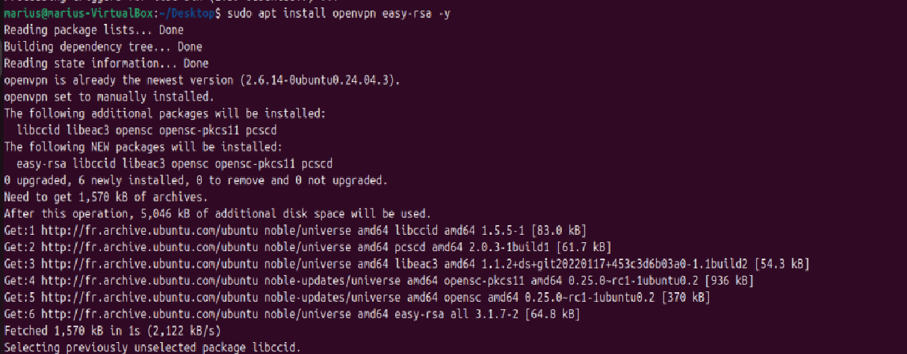
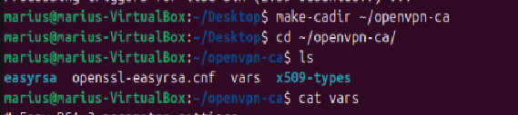
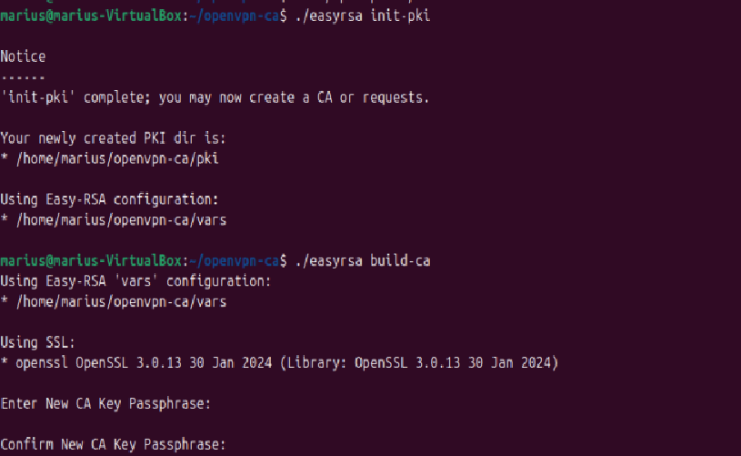
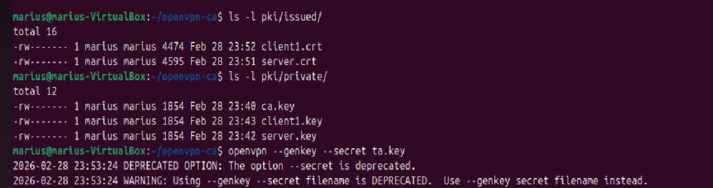
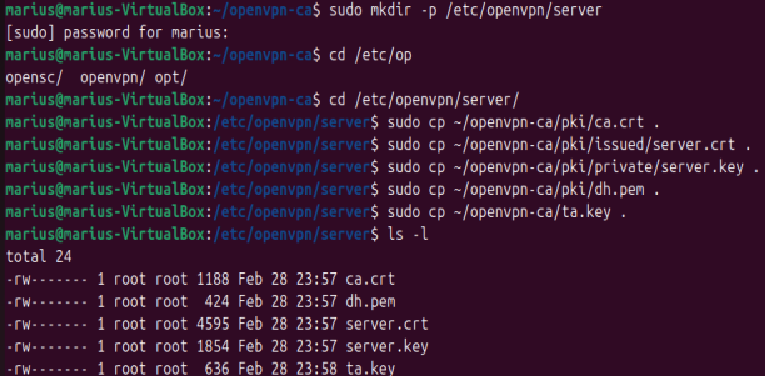
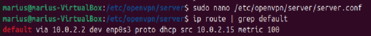
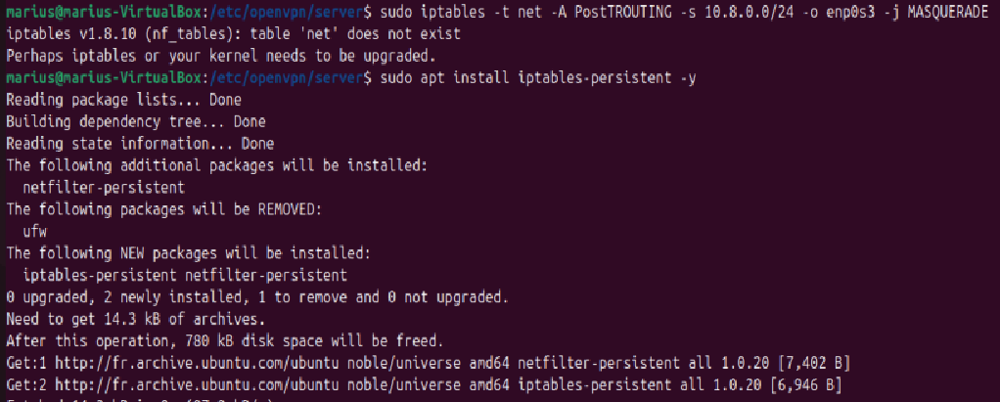
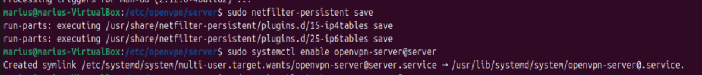

# TP6 – Mise en place d'un serveur OpenVPN sur Ubuntu Server

## Préparation du système

- Mise à jour du système et installation des paquets `openvpn` et `easy-rsa`.

---

## Partie 1 : Comprendre la PKI

### 1. À quoi sert une autorité de certification (CA) ?
Une autorité de certification (CA) est une entité de confiance qui délivre et signe des certificats numériques. Dans un VPN, elle permet de garantir l’authenticité des certificats du serveur et des clients. En signant les requêtes de certificats, elle assure que les parties sont bien celles qu’elles prétendent être.

### 2. Quelle différence entre clé privée et certificat ?
La **clé privée** est un fichier secret (ex: `server.key`) qui ne doit jamais être partagé. Elle sert à déchiffrer les données et à signer. Le **certificat** (ex: `server.crt`) est un fichier public contenant la clé publique du propriétaire et des informations d’identité, le tout signé par la CA. Il permet à un tiers de vérifier l’identité du possesseur de la clé privée.

### 3. Pourquoi un serveur VPN a-t-il besoin de certificats ?
Les certificats permettent une authentification mutuelle entre le serveur et les clients. Ils garantissent que le client se connecte au bon serveur et que le serveur n’accepte que des clients légitimes, évitant ainsi les attaques de type « homme du milieu ».

---

## Création de l'infrastructure Easy-RSA

### Où Easy-RSA crée-t-il ses fichiers ?
Easy-RSA crée une arborescence dans le répertoire courant, principalement un dossier `pki/` contenant tous les fichiers générés (clés, certificats, requêtes).

### Que contient le dossier `pki/` ?
- `ca.crt` : certificat de l’autorité de certification.
- `issued/` : certificats signés (serveur, clients).
- `private/` : clés privées (CA, serveur, clients).
- `reqs/` : requêtes de certificats non signées.
- `dh.pem` : paramètres Diffie-Hellman.
- `serial` : suivi des numéros de série.

### Quelle est la différence entre `gen-req` et `sign-req` ?
- `gen-req` crée une **requête de certificat** (CSR) et une clé privée. La requête contient les informations d’identité et la clé publique, mais elle n’est pas encore valide car non signée.
- `sign-req` utilise la clé privée de la CA pour **signer** la requête et produire un certificat officiel, reconnu par l’infrastructure.

### Que se passe-t-il si vous oubliez de signer un certificat ?
Si un certificat n’est pas signé, il n’est pas reconnu par la CA. Lors de la connexion, le serveur ou le client refusera le certificat (erreur de vérification) et la connexion échouera.

---

## Partie 2 : Configuration du serveur OpenVPN

### Éléments de configuration
- **Port d’écoute** : généralement 1194.
- **Protocole** : UDP (recommandé) ou TCP.
- **Interface virtuelle** : `tun` (routage IP) ou `tap` (Ethernet).
- **Réseau attribué aux clients** : par exemple `10.8.0.0/24`.
- **Références aux certificats** : chemins vers `ca.crt`, `server.crt`, `server.key`, `dh.pem`, et éventuellement `ta.key` pour TLS.

### Questions

**Que signifie `dev tun` ?**  
`dev tun` indique que le serveur OpenVPN doit créer une interface réseau virtuelle de type TUN (tunnel IP), ce qui permet de router le trafic au niveau IP. C’est le mode le plus courant pour un VPN.

**Quelle est la différence entre UDP et TCP pour un VPN ?**  
- **UDP** est plus rapide et léger, mieux adapté pour la plupart des VPN car il évite les retransmissions superflues.  
- **TCP** est plus fiable mais ajoute une surcharge ; il peut être utile si UDP est bloqué, mais peut causer des problèmes de performances (TCP dans TCP).

**Quelle plage IP choisir pour le VPN ? Pourquoi ?**  
On choisit une plage d’adresses privées non utilisées ailleurs (ex: `10.8.0.0/24`). Elle ne doit pas chevaucher les réseaux locaux du serveur ou des clients pour éviter les conflits de routage.

---

## Routage et NAT

### Questions

**Où se configure le paramètre `ip_forward` ?**  
Il se configure dans le fichier `/etc/sysctl.conf` (décommenter `net.ipv4.ip_forward=1`) ou via la commande `sysctl -w net.ipv4.ip_forward=1`. C’est un paramètre noyau qui permet de router les paquets entre interfaces.

**Quelle commande permet d'afficher les règles NAT actuelles ?**  
`sudo iptables -t nat -L -n -v` (ou `nft list ruleset` selon le pare-feu utilisé).

**Pourquoi faut-il "masquerader" le réseau VPN ?**  
Le masquerading (SNAT) modifie l’adresse source des paquets sortant des clients VPN pour qu’ils apparaissent avec l’IP publique du serveur. Ainsi, les clients peuvent accéder à Internet et les réponses leur sont correctement routées.

---

## Démarrage et analyse du service

### Si le service échoue

**Quelle commande permet d'afficher les logs système d'un service ?**  
`journalctl -u openvpn-server@server` (ou consultation du fichier de log spécifique comme `/var/log/openvpn.log`).

**Quelle est la différence entre `status` et `journalctl` ?**  
- `systemctl status` donne un résumé rapide de l’état du service et les dernières lignes de log.  
- `journalctl` permet de consulter l’intégralité des logs du service avec options de filtrage, plus adapté pour un diagnostic approfondi.

**Les chemins vers les certificats sont-ils corrects ?**  
Il faut vérifier que les fichiers référencés dans la configuration existent et ont les bonnes permissions (lecture pour l’utilisateur `nobody`). Une erreur courante est un chemin erroné ou des permissions trop restrictives.

---

## Partie 3 : Création du profil client

### Éléments à inclure dans le fichier `.ovpn`
- Adresse publique du serveur et port.
- Certificat CA (contenu entre balises `<ca>`).
- Certificat client (contenu entre `<cert>`).
- Clé privée client (contenu entre `<key>`).
- Paramètres de chiffrement (cipher, tls-crypt, etc.).
- Authentification TLS (clé partagée entre `<tls-crypt>`).

### Questions

**Comment intégrer un certificat directement dans un fichier `.ovpn` ?**  
En utilisant les balises `<ca>`, `<cert>`, `<key>` et `<tls-crypt>` et en recopiant le contenu des fichiers respectifs entre les balises d’ouverture et de fermeture. Cela permet d’avoir un fichier unique contenant toute la configuration et les certificats.

**Pourquoi la clé privée ne doit-elle jamais être partagée publiquement ?**  
Parce qu’elle constitue le secret permettant de prouver son identité. Si elle est divulguée, n’importe qui peut usurper l’identité du client, déchiffrer des communications ou signer frauduleusement des données.

---

## Tests et validation

### Comment vérifier que votre trafic passe par le VPN ?
- Comparer son adresse IP publique avant et après connexion (via un site comme ifconfig.me).
- Observer la table de routage : la route par défaut doit pointer vers l’interface `tun0`.
- Effectuer un traceroute : les premiers sauts doivent passer par le serveur VPN.

### Que se passe-t-il si le port 1194 est bloqué ?
Si le port UDP 1194 est bloqué (pare-feu du serveur ou réseau intermédiaire), la connexion échoue (timeout). On peut alors utiliser un autre port ou passer en TCP (ex: port 443) pour contourner certains blocages.

---

## Partie 4 : Bonus

- **Ajouter plusieurs clients** : générer autant de certificats clients que nécessaire.
- **Mettre en place une révocation de certificat** : révoquer un certificat avec Easy-RSA et inclure la liste de révocation (CRL) dans la configuration serveur.
- **Passer le VPN en TCP** : modifier `proto udp` en `proto tcp` dans les configurations.
- **Activer une authentification par mot de passe en complément** : utiliser `auth-user-pass-verify` avec un script d’authentification (PAM, fichier, etc.).

---